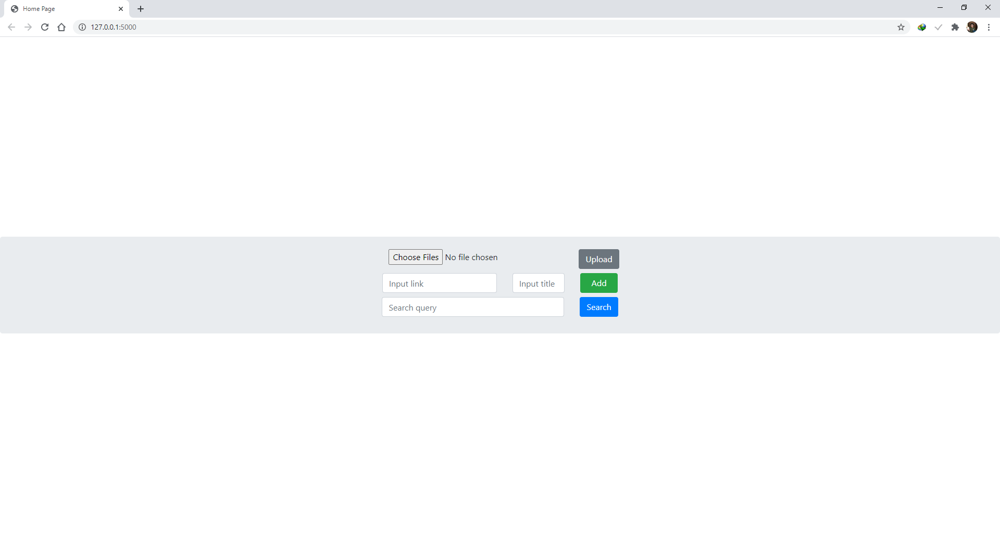
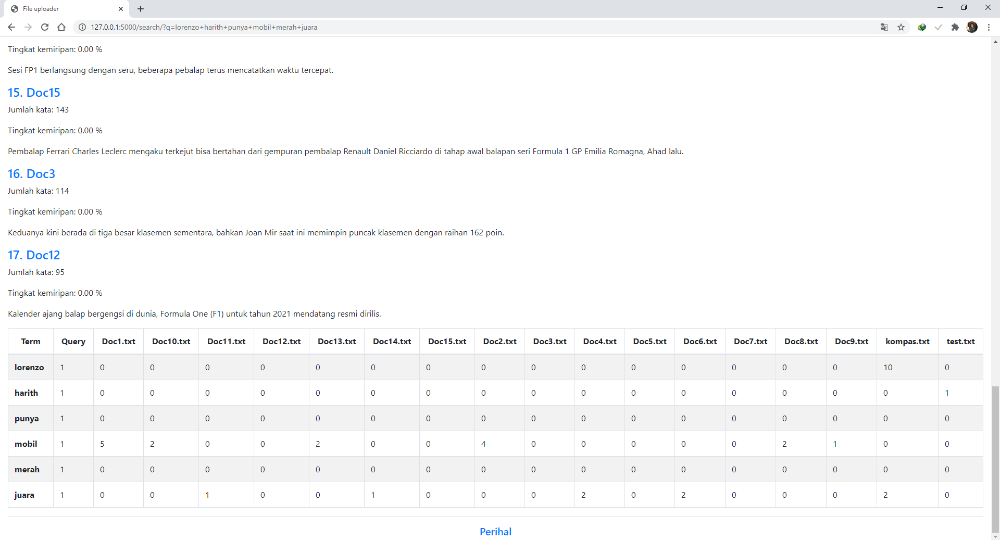
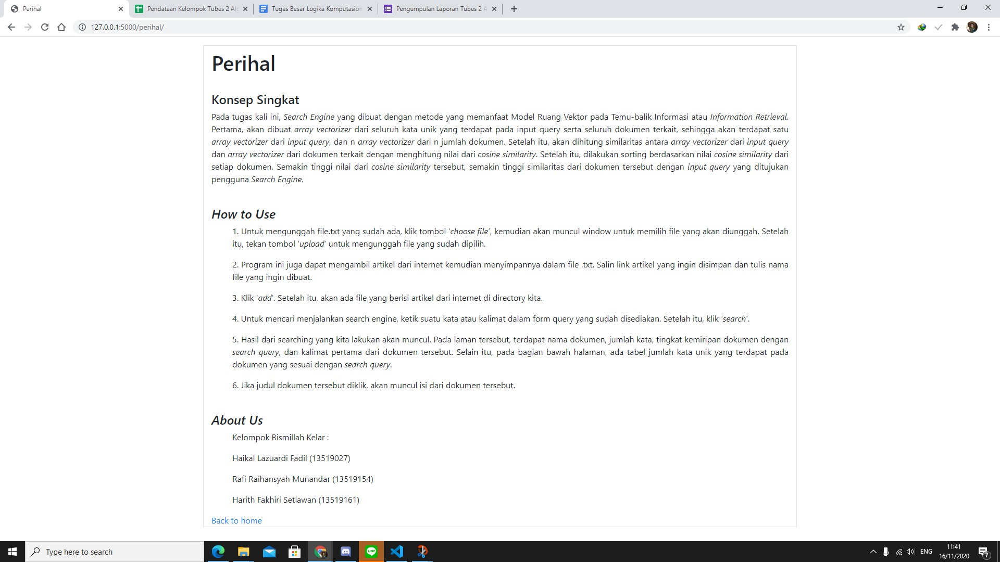

# Algeo02-19027
> Search query yang menggunakan aplikasi dot product pada vektor.

## Table of contents
* [General info](#general-info)
* [Screenshots](#screenshots)
* [How to use the program](#How-to-use-the-program)
* [Setup](#setup)
* [Web usage](#Web-usage)
* [Status](#status)
* [Inspiration](#inspiration)
* [Contact](#contact)

## General info
Program ini dibuat untuk memenuhi Tugas Besar Algeo 02. Program ini menggunakan bahasa pemrograman python dan html. Untuk aplikasi backend menggunakan python dengan framework Flask dan dibantu dengan library Sastrawi, regex, BeautifulSoup, dan requests. Program ini dapat menerima input file ataupun menerima input link yang akan dikonversi menjadi dokumen kemudian disimpan. Kemudian, program menerima search query yang kemudian akan menampilkan hasil dari search query berupa urutan dokumen yang terurut berdasarkan similarity tertinggi.

## Screenshots




# How to use the program
## Setup
Cara install:
* Install Python versi 3.
* Pastikan pip juga terintall.
* Install library yang diperlukan berupa flask, sastrawi, regex, beautifulsoup, dan requests.
```sh
$ pip install flask
$ pip install Sastrawi
$ pip install regex
$ pip install beautifulsoup4
$ pip install requests
```
* Masuk ke directory src `$ cd Algeo02-19027/src`
* Jalankan main.py `$ Algeo02-19027/src python main.py`
* Masukkan URL live local server ke web (http://127.0.0.1:500/)
* Program siap digunakan

## Web usage
* Input via file melalui Upload file (menerima file dengan extension .txt) kemudian klik tombol `upload`.
* Input via link (konten link akan otomatis dikonversi menjadi file .txt) kemudian tentukan nama file (judul), kemudian klik tombol `add`.
* Masukan input search query dan klik `search`, kemudian akan ditujukan ke laman hasil query.
* Laman hasil query berisi urutan dokumen yang dapat diklik untuk melihat konten dokumennya, serta ada tabel jumlah kata masukan query pada setiap dokumen.
* Pada laman hasil query, akan ada tombol `<< Home` untuk kembali ke homepage dan menggunakan upload file/link lagi.
* Pada bagian footer setiap page akan ada hyperlink menuju laman perihal.